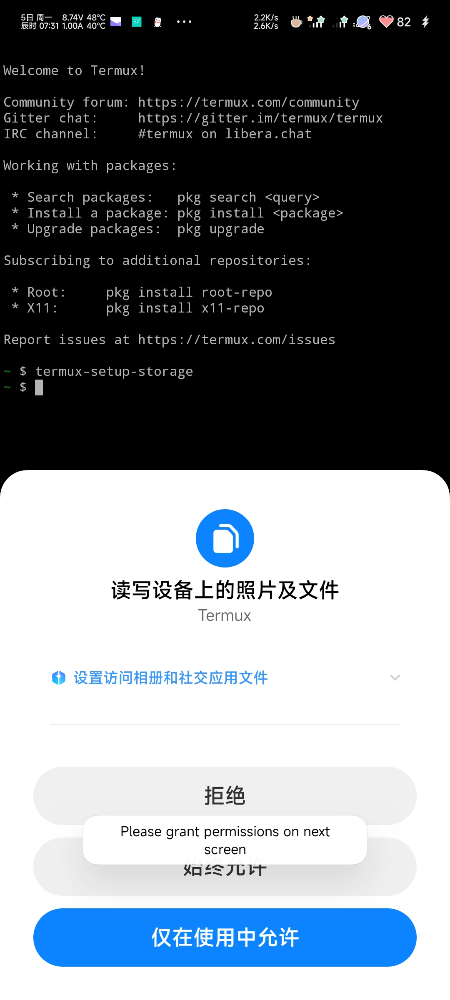
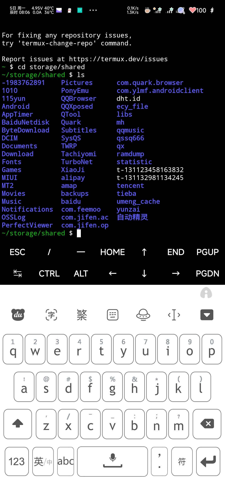
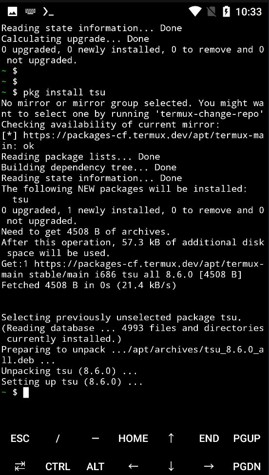
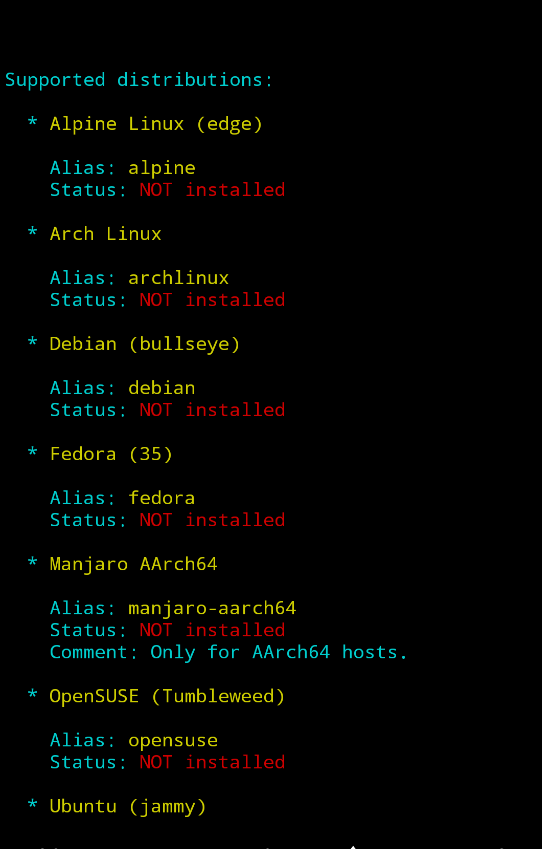
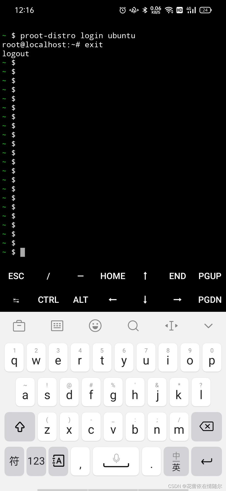
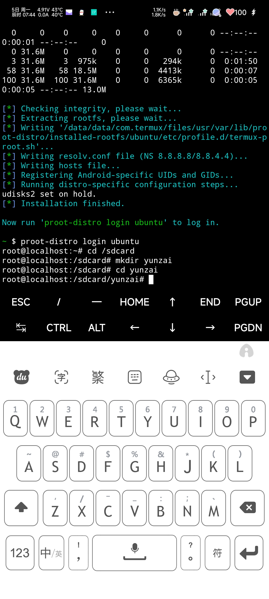
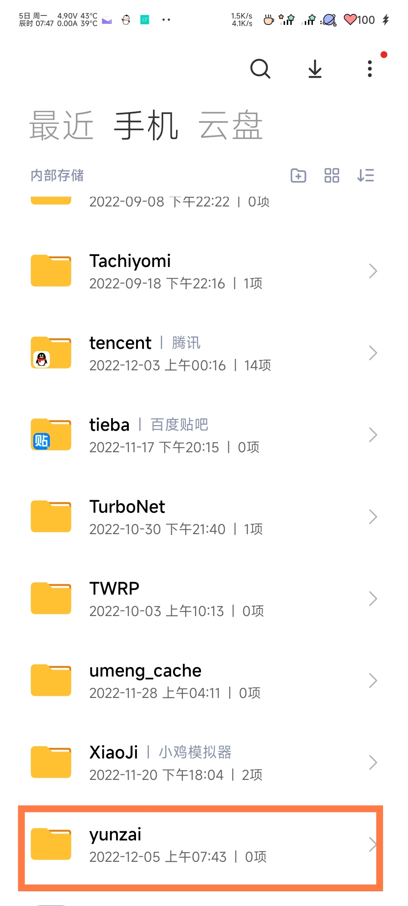

::: info

本教程基于 [Yunzai-Bot 安卓手机搭建教程](https://www.bilibili.com/read/cv15126105)
[原神 Q 群机器人安卓手机部署帮助](https://www.bilibili.com/read/cv17479494)

:::

::: warning
本教程基于 Ubuntu，使用前请确保拥有一定的 Linux 基础，遇到问题请善用 Google/Bing/百度。
若对 Linux 了解程度不够，请尽量使用一个干净的系统部署。

:::

::: tip

所需配置

- 任意一台安卓 7.0 以上版本的安卓手机
- via 浏览器
- Termux (用于安卓 7.0 以上版本)
- 无需 root

:::

## 下载安装 Termux

[下载地址：](https://f-droid.org/packages/com.termux/)
滑到下方点击下载


## 将手机存储映射到Termux

此步是为了将手机文件管理器默认根目录映射到Termux，方便无root用户后续对机器人以及插件进行备份及管理
有root用户或无需备份或修改插件隐藏设置及更改功能的可无视此步骤

下载完成后首先运行映射命令
```bash
termux-setup-storage
```
此时会弹出请求权限对话框，请点击“始终允许”或“仅在使用过程中允许”



随后查看是否能够看到手机文件管理器根目录中的内容
```bash
cd storage/shared
ls
```
若看到显示了文件夹的内容，则表示映射成功



## 安装环境

::: info
因为 Termux 官方支持安装纯原生安装 Linux 所以之前的方法作废直接采用官方方法安装
:::
### 1. Termux 换源

替换镜像源是为了之后安装软件更快，之前都是几十 KB 每秒，替换过后就是几 MB 每秒。
使用如下命令行替换官方源为 TUNA 镜像源：

只需在 $ 后输入以下四行命令 (在输入每行后按回车)

```bash
sed -i 's@^\(deb.*stable main\)$@#\1\ndeb https://mirrors.tuna.tsinghua.edu.cn/termux/termux-packages-24 stable main@' $PREFIX/etc/apt/sources.list
```

```bash
sed -i 's@^\(deb.*games stable\)$@#\1\ndeb https://mirrors.tuna.tsinghua.edu.cn/termux/game-packages-24 games stable@' $PREFIX/etc/apt/sources.list.d/game.list
```

```bash
sed -i 's@^\(deb.*science stable\)$@#\1\ndeb https://mirrors.tuna.tsinghua.edu.cn/termux/science-packages-24 science stable@' $PREFIX/etc/apt/sources.list.d/science.list
```

```bash
pkg update && pkg upgrade -y
```


### 2. 安装 sudo 软件

Linux sudo 命令以系统管理者的身份执行指令，也就是说，经由 sudo 所执行的指令就好像是 root 亲自执行。

使用权限：在 /etc/sudoers 中有出现的使用者。

一开始是不能用 sudo 命令的，所以需要输入以下命令安装 sudo 软件

```bash
pkg install tsu
```



### 3. 安装 Linux 环境

**上方的换源,安装基础操作做完就可以开始正式安装Linux了(本教程以Ubuntu为主)**

1. 安装基础组件proot-distro

```bash
pkg install proot-distro
```

对于该命令的解释:
    proot-distro 是一个用于在 Termux 中安装 Linux 发行版的工具。它使用 proot 作为后端，因此它不需要 root 权限。
    目前他支持以下Linux发行版

- Alpine Linux (edge)
- Arch Linux / Arch Linux 32 / Arch Linux ARM
- Debian (stable)
- Fedora 35
- Manjaro AArch64
- OpenSUSE (Tumbleweed)
- Ubuntu (22.04)
- Void Linux

2. 查看可安装Linux系统

```bash
proot-distro list
```



3. 安装Ubuntu

输入:

```bash
proot-distro install ubuntu
```

4. 安装完成后，进入 Linux(Ubuntu)环境的指令为：

```bash
proot-distro login ubuntu
```

出现root@localhost:~# 代表已进入Ubuntu环境


在后面输入 exit 回车 即可退出Ununtu环境。



### 4. Ubuntu 设置

进入Ubuntu后先在文件管理器根目录建立“yunzai”文件夹并进入此文件夹

```bash
cd /sdcard
mkdir yunzai
cd yunzai
```


此时可见手机根目录多出了一个该文件夹



后面步骤均在此文件夹进行操作
（有root用户及无需备份及管理机器人目录的可不进行进入ubuntu至此的这两步操作）

随后进行apt更新

``` bash
apt update
```


安装 curl

``` bash
apt install curl
```


安装node.js

```bash
apt install nodejs npm
```

上面的命令将会安装一系列包，包括编译和安装从 npm 来的本地扩展。
安装完成后运行下面的命令，验证安装过程：

```bash
nodejs -v
```


我们可以看到node的版本是node12.22.9但是yunzai-bot对node的需求是node16
所以我们需要利用node有一个模块叫n，是专门用来管理node.js的版本。

安装n模块

```bash
npm install -g n
```

升级到最新稳定版

```bash
 n stable
```

**Ps:** n 后面也可以跟随版本号（用于升级或降级）比如：  

```bash
n 16.13.0
```

升级完成再次运行

```bash
node -v
```

查看node版本
注意：升级完成如果`node -v`没变的话
退出重启一下Termux重新运行

```bash
proot-distro login ubuntu
```

进入 Ubuntu
然后运行
`node -v`查看 node 版本


我们可以看到 node 的版本已经升级到了 node18.12.1

安装并运行 redis

```bash
apt -y install redis && redis-server --daemonize yes
```

克隆项目

```bash
git clone --depth=1 -b main https://gitee.com/Le-niao/Yunzai-Bot.git

```

安装模块

```bash
cd Yunzai-Bot
```

安装 pnpm

```bash
npm install pnpm -g
```

安装依赖

```bash
pnpm install -P
```

安装 chrome 依赖库

```bash
yum install pango.x86_64 libXcomposite.x86_64 libXcursor.x86_64 libXdamage.x86_64 libXext.x86_64 libXi.x86_64 libXtst.x86_64 cups-libs.x86_64 libXScrnSaver.x86_64 libXrandr.x86_64 GConf2.x86_64 alsa-lib.x86_64 atk.x86_64 gtk3.x86_64 -y && yum install libdrm libgbm libxshmfence -y && yum install nss -y && yum update nss -y
```

安装中文字体

```bash
yum groupinstall fonts -y
```

运行

```bash
node app
```

按提示输入qq号，密码，cookie

首次登录要过滑块验证，可以用滑块验证助手 <https://maupdate.rainchan.win/txcaptcha.apk>

打开验证助手输入验证链接，手动过了滑块验证后，获得tickek

复制获得的tickek然后粘贴回车，最后再过密保登录


再次运行需要先打开Ubuntu

```bash
proot-distro login ubuntu
```

开启redis

```bash
redis-server --daemonize yes
```

然后运行

```bash
cd Yunzai-Bot
node app
```
